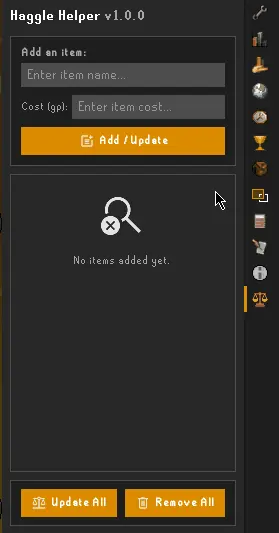
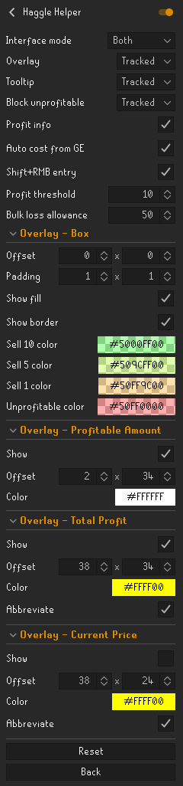
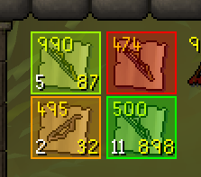
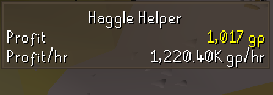
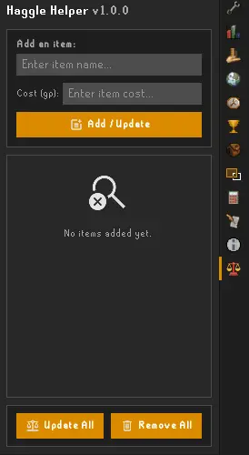

# Haggle Helper

### Helps you haggle with NPC shops to maximize profit. Track your item costs, visualize profitable quantities and total profit, see current prices, prevent unprofitable sales, monitor total profit and profit/hr, and more!

## Features

Haggle Helper can:

- Highlight profitable and unprofitable shop sales with configurable overlays
- Show how many items can be traded profitably (Sell 1, Sell 5, Sell 10, etc.)
- Display current buy/sell price and potential profit directly on item overlays
- Show tooltips detailing the revenue and profit of the current action
- Block unprofitable transactions with configurable allowance for bulk transactions
- Monitor total profit and profit/hr in a dedicated info panel
- Track custom item costs or automatically use Grand Exchange prices
- Fully customizable colors, text displays, and overlay positioning

 ## Tracking Items

Add items and their costs either through the side panel or by shift+right-clicking them. The next time you open a shop, Haggle Helper automatically highlights which tracked items can be sold/bought for a profit, how many are worth selling/buying, and the total profit after accounting for price reductions, and more!

| Panel | | Shift+RMB |
| :---: | :-: | :---: |
|  | |  |

If you'd rather not track items individually, change the relevant config option from **"Tracked"** to **"All"** and Haggle Helper will work for untracked items using their current Grand Exchange price, as well as tracked ones using their custom costs.

## Config options

### <u>Interface mode:</u>
 - **Inventory:** Display overlays/tooltips in the inventory only
 - **Shop:** Display overlays/tooltips in the shop only
 - **Both:** Display overlays/tooltips in both

 

### <u>Overlay:</u>
 - **None:** Do not display overlays
 - **Tracked:** Display overlays for tracked items only
 - **All:** Display overlays for all items (using GE price for non-tracked)

 

### <u>Tooltip:</u>
 - **None:** Do not display tooltips
 - **Tracked:** Display tooltips for tracked items only
 - **All:** Display tooltips for all items (using GE price for non-tracked)

 

### <u>Block unprofitable:</u>
 - **None:** Do not block unprofitable transactions
 - **Tracked:** Block unprofitable transactions for tracked items only
 - **All:** Block unprofitable transactions for all items (using GE price for non-tracked)

A transaction will be considered unprofitable if: **(1)** the profit is negative, or **(2)** the profit doesn't exceed the *profit threshold* per item, or **(3)** in the case when more than the optimal number of items are being sold, the absolute difference between the profit and the maximum possible profit (ie. the "lost profit") is greater than the *bulk loss allowance* (ie. a loss up to the threshold is tolerated for convenience)

 

### <u>Profit info:</u>

 - Show the profit info panel:

 

### <u>Auto cost from GE:</u>

 - Automatically populate the "Cost (gp):" box with the item's GE price when tracking items via the panel

 

### <u>Shift+RMB entry</u>

 - Add a "Track item" entry to the menu when shift-right-clicking an item. 

### <u>Profit threshold</u>

 - The per-item profit amount that must be exceeded for an item to be considered profitable, as described in the "Block unprofitable" section above. This value is useful when obtaining items has an inherent opportunity cost or other such associated costs, so selling for only, say, a few gp profit each would be undesirable. 

 

### <u>Bulk loss allowance</u>

 - The allowed profit loss, as compared to the maximum possible amount, tolerated when performing a bulk transaction. For example, say only 8 are items profitable but the "Sell 10" option is being used: if the absolute difference between the profit from selling 10 and selling 8 is less than the bulk loss allowance, then the transaction will be allowed; if it exceeds the allowance then it will be blocked (assuming block unprofitable is enabled).

 

## Overlay - Box

### <u>Offset</u>
 - The pixel offset of the overlay box

### <u>Padding</u>
 - The pixel padding of the overlay box

### <u>Show fill</u>
 - Show the colored background of the overlay box

### <u>Show border</u>
 - Show the colored border of the overlay box

### <u>Colors</u>
 - **Sell 10:** the color used when "Sell 10" option is profitable
 - **Sell 5:** the color used when "Sell 5" option is profitable
 - **Sell 1:** the color used when "Sell 1" option is profitable
 - **Unprofitable:** the color used when the item is unprofitable

## Overlay - Profitable Amount

### <u>Show</u>
 - Show the profitable amount, ie. the number of items which are profitable

### <u>Offset</u>
 - The pixel offset for the profitable amount text - by default it is in the bottom left

### <u>Color</u>
 - The color of the profitable amount text

## Overlay - Total Profit

### <u>Show</u>
 - Show the total profit amount, ie. the profit made from the profitable amount

### <u>Offset</u>
 - The pixel offset for the total profit text - by default it is in the bottom right

### <u>Color</u>
 - The color of the total profit text

### <u>Abbreviate</u>
- Abbreviate the total profit text when appropriate, eg. 54321 becomes 54.3k

## Overlay - Current Price

### <u>Show</u>
 - Show the current buy/sell price of the item - by default it is off

### <u>Offset</u>
 - The pixel offset for the current price text - by default it is in the center right

### <u>Color</u>
 - The color of the current price text

### <u>Abbreviate</u>
 - Abbreviate the current price text when appropriate, eg. 54321 becomes 54.3k
